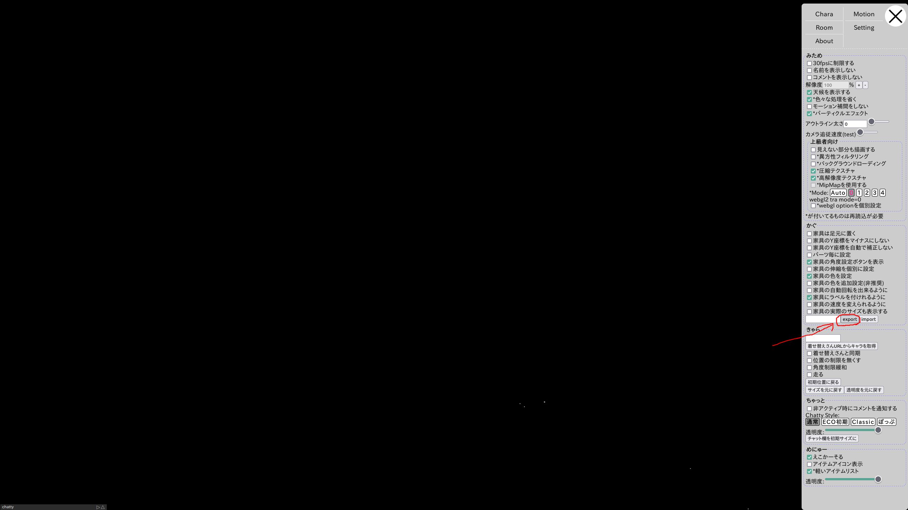

# 
某酒場 家具の位置データ

# 
目的

家具の位置データをgitを使って操作履歴、家具位置のバックアップを管理する 
export履歴を家具の位置を変更するたびにgitに記録するのが目的

##  
使い方

* 某酒場の操作 (家具に変更があった場合)  
  1. 画面左のメニューからSettingをクリック 
  

  2. exportをクリックして文字列を表示させる 
  

  3. exportの文字列をコピーする 
  

 
* ここから文字列を貼りける操作 
1. ディレクトリ内のkagu_export_data.txtをエディタで開いて 
2. kagu_export_data.txtに書いてある文字列を削除 
3. 某所でコピーした文字列をに貼りけて保存 
おまけ この操作をターミナルで操作する場合は ディレクトリを移動して 次のコマンド打てok 
$ echo '某所でコピーした文字列' | > kagu_export_data.txt 
 
* ここからgitの操作 
1. cd ディレクトリ名 
2. git add . 
3. git commit -m $(LANG=C date +%F_%T_%Z)  
4. git push origin ブランチ名  
 
## その他 
相談、質問、グループメンバー参加、などはIssueへ

